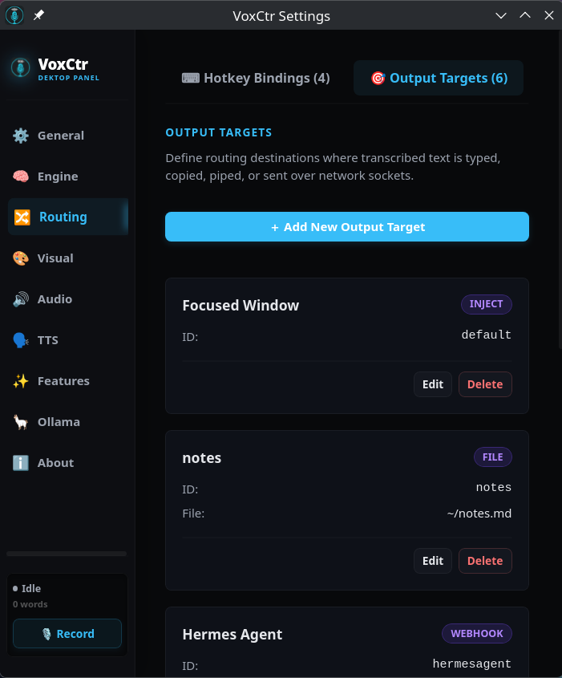

# VoxCtr


A high-performance, private, on-device voice-to-text dictation application and programmable **voice input broker** built natively in Rust and Tauri with a Svelte frontend. 

**Zero Telemetry. Zero Cloud. 100% On-Device.**
VoxCtr acts as an intelligent desktop voice gateway, routing your speech to any destination—whether typing directly into a focused window, invoking terminal agents, appending to journals, triggering shell commands, or feeding local AI assistants.

---

## 🔒 Privacy First & Fully On-Device

In an era of cloud processing, VoxCtr is built from the ground up to guarantee absolute data sovereignty:
* **No Cloud API Keys Required**: VoxCtr relies exclusively on OpenAI's Whisper models (via native CPU/GPU accelerated `whisper-rs`) running directly on your local hardware.
* **No Telemetry**: Your ambient microphone data never leaves your machine. There are no hidden tracking scripts or analytical pings.
* **Air-Gapped Ready**: Once the application and models are downloaded, VoxCtr requires zero internet access to function.
* **Local Neural Voices**: All text-to-speech feedback is generated offline via a local Piper engine.

---

## 🌟 Key Features

* **High-Performance Offline Speech Recognition**: Local on-device inference using native `whisper.cpp` (via `whisper-rs`) supporting multi-threaded CPU execution. NVIDIA CUDA GPU acceleration is available as an opt-in compile-time feature (`--features cuda`); Vulkan acceleration (AMD/Intel/NVIDIA) works in the standard build.
* **Modern GUI & Tray System**: A sleek Svelte-based user interface with dedicated, swappable overlays (Waveform, Pulse Circle, and Voice Card), a searchable transcription history panel, and a native desktop System Tray utility.
* **Low-Latency Audio Loop**: Streamlined recording and VAD (Voice Activity Detection) built using `cpal` to minimize capture latency.
* **Built-in Model Context Protocol (MCP) Server**: Exposes voice dictation and speech synthesis as high-level JSON-RPC tools to AI clients (like Claude Desktop or Cursor) via local secure sockets—keeping integrations fully local.
* **Linux evdev Global Hotkeys**: Low-level event loop listener bypassing desktop environments to bind global hold-to-talk, toggle-to-talk, or double-tap gestures directly to any keyboard.
* **DBus Dictation Service**: Exposes `ai.voxctl.Dictation` on the local Linux session bus, letting you script recording states securely without network exposure.
* **Neural Text-to-Speech (TTS)**: Built-in local neural voice feedback powered by Piper, with automatic local package installation and a voice downloader interface.
* **Intelligent Post-Processing & Ollama**: Real-time automatic filler-word cleanup (e.g. stripping "um", "uh", "hmm") to sanitize dictation, combined with optional **local Ollama integration** (supporting Llama 3.2, Phi-3, or Mistral) for real-time grammar correction, tone rewriting, or custom formatting.

---

## 🎯 The Deep Targeting System

The core of VoxCtr is its **Output Target Router**. Rather than simply pasting text where your cursor is, VoxCtr allows you to declare **named output targets** in `targets.toml` and bind them to different global keyboard gestures. This turns your voice into a programmable router.

**New in v0.1:** You can now bind **multiple targets** to a single hotkey gesture! When activated, your text is broadcast concurrently to all bound targets. Configurations also **hot-reload instantly** in the background, without requiring an app restart.

Below are the 9 target types supported by VoxCtr and what they are used for:

| Delivery Type | Mechanism | Perfect Use Case |
| :--- | :--- | :--- |
| **`inject`** | Keystroke simulation via native `wtype` (Wayland), `xdotool` (X11), or PowerShell (Windows). | Standard voice dictation directly into any focused editor, web browser, or chat window. |
| **`clipboard`** | Fast clipboard population using the native `arboard` library. | Quiet copying of notes, code snippets, or templates for manual pasting without modifying active focuses. |
| **`exec`** | Spawns a shell command substituting `{TEXT}` cleanly and safely (uses `shell=False` to prevent command injection). | Integrating with CLI tools (e.g., pipe directly into `llm {TEXT}`, open a web search, or post to `git commit -m "{TEXT}"`). |
| **`pipe`** | Writes raw transcription bytes to a local named FIFO pipe. | Interfacing with custom CLI shell scripts, event listeners, or local terminal agents waiting for command buffers. |
| **`socket`** | Streams text directly over a TCP connection or local Unix Domain Socket. | Communicating with long-running daemons, remote servers, or external development container environments. |
| **`file`** | Appends transcriptions to a local file with customizable prefixes and optional UTC timestamps. | Automatic hands-free voice journaling, log keeping, standup note compilation, or task lists. |
| **`dbus`** | Emits a custom DBus signal containing the text on the session bus. | Triggering complex desktop notification actions, scripting custom desktop widget updates, or chaining custom system automation. |
| **`http`** | Sends a fast HTTP POST/GET request containing the transcription formatted inside a JSON template. | Streaming transcriptions directly to webhooks, database ingestion services, or remote HTTP endpoints. |
| **`webhook`** | Sends a signed, secure HTTP POST request with an HMAC-SHA256 signature generated using a shared secret. | Securely connecting dictation triggers to external APIs or home automation platforms (e.g., Home Assistant). |

---

## 🛠️ The Architecture

```
                  ┌──────────────────────────────┐
                  │    evdev Input Listener      │
                  │  (Hold / Toggle / Double)    │
                  └──────────────┬───────────────┘
                                 │ on_press(target_id)
                                 ▼
                  ┌──────────────────────────────┐
                  │  Recording Module (cpal)     │
                  └──────────────┬───────────────┘
                                 │ float32 raw audio chunks
                                 ▼
                  ┌──────────────────────────────┐
                  │   Whisper Inference Engine   │
                  │  (whisper.cpp via CUDA/CPU)  │
                  └──────────────┬───────────────┘
                                 │ (transcription, target_id)
                                 ▼
                  ┌──────────────────────────────┐
                  │     Output Target Router     │
                  │      (targets.toml)          │
                  └───────┬───────┬────────┬─────┘
                          │       │        │
                          ▼       ▼        ▼
                  ┌──────────────────────────────┐
                  │  Optional AI Post-processing │
                  │  (Filler Removal / Ollama)   │
                  └───────┬───────┬────────┬─────┘
                          │       │        │
            ┌─────────────┘       │        └─────────────┐
            ▼                     ▼                      ▼
     [inject / clipboard]    [exec / pipe / file]   [dbus / http / socket]
            │                     │                      │
            ▼                     ▼                      ▼
     Focused Editor          Terminal / Scripting    Integration Services
```

---

## 🖥️ User Interface

VoxCtr provides a clean, native settings window and overlay environment:



### 📌 Interactive Settings UI
* **General tab**: Configure core system attributes, including the local MCP JSON-RPC server toggles, record timeouts, and Wayland/X11 AT-SPI2 text injection behaviors.
* **Visual tab**: A premium Cyber Obsidian interface that groups all aesthetic and presentation settings. It features an interactive **Overlay Style Selector** (supporting Voice Card, Waveform, Pulse Ring, Ocean Wave, or Disabled styles), toggles for displaying heads-up HUD overlays while speaking, and controls for sending system notifications on transcription. It also lets you configure if the Settings window should open automatically at launch or start minimized in the system tray.
* **Audio tab**: Configure device gain, input indices, and toggle dynamic streaming/VAD threshold settings.
* **Routing tab**: Define named targets (`targets.toml`), delivery properties, and post-processors.
* **Hotkeys tab**: Setup keybindings (`bindings.toml`) and detect subset/exact-match conflicts in real time.
* **Voice Output tab**: Download and preview Piper voices for local speech synthesis.

### 🎨 Heads-Up HUD Overlay Styles

VoxCtr features a dynamic transparent overlay window that renders floating real-time audio visualization above your desktop during dictation. The visual presentation is fully hot-swappable in the **Visual Tab** settings (which synchronizes across windows in real-time) and supports five unique visual options:

1. **Ocean Wave (Default) 🌊**
   A premium, liquid fluid animation utilizing three overlapping, semi-transparent SVG wave layers (Deep Blue, Aqua Cyan, and Ice Teal) that execute dynamic parallax sliding.
   * **Voice Reactive Swelling:** The amplitude of all waves swells dynamically in response to microphone sound levels.
   * **Active Sea Level Rise:** The overall average water level swells upward as you speak and recedes to a low tide when silent.
   * **Gentle Breathing Ripple:** In absolute silence, the waves execute a slow, calming idle ripple animation.

2. **Voice Card 🎙️**
   A state-of-the-art capsule-shaped overlay card featuring the active target window name/badge and an ultra-reactive 45-bar graphic equalizer waveform.
   * **Hyper-Sensitive Physics:** Calibrated with a snappier attack rate and instant release decay, animating HSL-gradient (purple-pink-rose) bars that swell and dance with your voice activity.
   * **Symmetric Layout:** The visualizer mirrors symmetrically from the center for a premium, high-tech graphic equalizer aesthetic.

3. **Waveform 📈**
   A wider Obsidian-style widget designed with a central horizontal dotted axis and a 48-bar Gaussian center-weighted envelope. It utilizes a high-frequency organic noise fluctuation on activity and transitions to a smooth sine-wave glide during AI post-processing/thinking phases.

4. **Pulse Ring 🟠**
   A minimalist, hyper-clean target tracking HUD composed of a solid orange core indicator surrounded by dual expanding, fading echo rings. The pulse speed and core glow scale dynamically on sound intensity to provide subtle, non-intrusive recording feedback.

5. **Disabled (None) ❌**
   Turns off the transparent heads-up display entirely, relying purely on tray icon changes or system bus triggers for dictation feedback.

### ⚙️ Window Management & Focus Raising
* **Foreground Focus Raising**: If the settings page is already open but hidden behind other windows, clicking the **⚙ Settings** button in the native system tray menu or double-clicking the system tray icon will trigger standard `show()` and `set_focus()` commands to immediately bring the settings dashboard to the absolute foreground of the screen.

---

## 🔌 Built-in Model Context Protocol (MCP) Server

VoxCtr features a native Model Context Protocol (MCP) server listening on a local Unix socket at `/tmp/voxctl-mcp.sock`. This allows advanced LLM agents (such as **Claude Desktop** or **Cursor**) to interface directly with your voice and speak responses back to you.

### Exposed MCP Tools
1. **`transcribe_voice(timeout_secs)`**: Prompts the application to open your default recording device, capture speech, transcribe it using the Whisper engine, and return the raw text to the model.
2. **`speak_text(text)`**: Queues text to be spoken aloud locally on the user's host machine using the configured Piper neural TTS engine.
3. **`get_status()`**: Returns a JSON object with boolean states indicating whether the microphone is currently recording or the TTS engine is currently speaking.

### 🎯 Generic MCP Routing Target
VoxCtr supports routing transcribed text directly to any local or networked MCP server via its **Output Target Router** using the `mcp` delivery type in `targets.toml`. 

The client is fully standard-compliant (Option B, performing `initialize` -> `notifications/initialized` -> `tools/call` handshakes on socket connect) to guarantee maximum compatibility with strict third-party MCP servers.

#### Configuration Schema
You can declare generic MCP targets in your `targets.toml` or configure them through the GUI Settings window:

```toml
[[target]]
id = "self_speak"
label = "Synthesize Speech Loopback"
delivery = "mcp"
mcp_path = "/tmp/voxctl-mcp.sock"   # Optional custom socket or pipe path (defaults to standard socket/pipe)
mcp_tool = "speak_text"            # The name of the MCP tool to call (defaults to 'speak_text')

[target.mcp_args]
text = "{TEXT}"                    # Custom arguments template (substitutes the transcription at {TEXT})
```

---

## 📦 Portable AppImage & Installation

VoxCtr runs natively on Linux (optimized for CachyOS/Arch, Ubuntu/Debian, Fedora, and openSUSE). We support seamless standalone execution using a portable **AppImage**, combined with an automation script that handles system integration and hotkey permissions.

### 1. Unified Setup & System Integration

To install runtime dependencies, fetch/configure the AppImage, and integrate VoxCtr into your desktop environment, run the unified `install.sh` script:

```bash
chmod +x install.sh
./install.sh
```

#### What `install.sh` accomplishes automatically:
* **System Runtime Packages**: Detects your package manager (`apt`, `pacman`, `dnf`, `zypper`) and installs WebKitGTK, OpenSSL, PortAudio, `wtype`, `xdotool`, and clipboard utilities.
* **AppImage Retrieval**: Checks for `VoxCtl-x86_64.AppImage` locally. If missing, it attempts to fetch the latest pre-compiled binary from GitHub. If not found or offline, it falls back to building it from source.
* **Low-Level Hardware Hotkeys**: Creates the `/etc/udev/rules.d/99-voxctl.rules` rule to permit access to `uinput`, and adds your user to the `input` group so the evdev key listener works globally without running the application as root.
* **Desktop Menu Integration**: Registers a modern `.desktop` entry in `~/.local/share/applications/` and copies application icons so VoxCtr appears in your desktop application menus.

> [!IMPORTANT]
> If `install.sh` adds your user account to the `input` group, you **must log out and log back in** (or reboot) for hardware global hotkeys to function correctly.

---

### 2. Standalone AppImage Compilation

If you wish to compile the application and bundle a fresh, portable AppImage manually from source, run the dedicated compiler script:

```bash
chmod +x build_appimage.sh
./build_appimage.sh
```

This compilation script:
* Restructures the workspace compiler toolchain, wrapping the local `appimagetool` to execute inside headless and FUSE-less build/sandbox environments using `--appimage-extract-and-run`.
* Runs frontend compilation via Vite/Svelte and compiles the Rust Tauri backend.
* Automatically injects system GPU/CUDA library paths into the compiler environment for hardware-accelerated transcription (if compatible NVIDIA cards are present).
* Moves and exposes the final, standalone, portable AppImage directly to the root of the workspace as `VoxCtl-x86_64.AppImage`.

---

### 3. Execution Options

Once set up, you can execute the application in three ways:

* **From Desktop Menu**: Launch **VoxCtr** directly from your desktop launcher or application drawer.
* **Standalone Portable AppImage**: Run the standalone AppImage executable in the root directory:
  ```bash
  ./VoxCtl-x86_64.AppImage
  ```
* **Helper Script Wrapper**: Run the workspace helper script:
  ```bash
  ./voxctr.sh
  ```

---

## ⚙️ Configuration File Schema

All configurations are stored locally inside `~/.config/voxctl/`.

### `targets.toml`
Defines the output target router destinations:
```toml
format_version = "1.1"

[[target]]
id = "default"
label = "Focused Window"
delivery = "inject"
append_newline = false

[[target]]
id = "notes"
label = "Meeting Journal"
delivery = "file"
file_path = "~/Documents/meeting_notes.md"
file_prefix = "- "
file_timestamp = true
```

### `bindings.toml`
Binds hotkey gestures directly to target IDs (supports single or **multiple sequential targets**):
```toml
format_version = "1.1"

[[binding]]
id = "dictate_hold"
label = "Dictate into Focused Window (Hold)"
keys = ["KEY_LEFTMETA", "KEY_SPACE"]
gesture = "hold"
target_id = "default"

[[binding]]
id = "dictate_and_log"
label = "Type & Save Journal (Hold)"
keys = ["KEY_LEFTCTRL", "KEY_LEFTMETA", "KEY_SPACE"]
gesture = "hold"
target_id = "default"                        # Backward compatibility fallback (first target)
target_ids = ["default", "notes"]            # Sequential delivery to both targets!
```

### Multi-Target Hotkey Bindings
VoxCtr supports routing your speech to **multiple output targets simultaneously** using a single hotkey gesture! 

When a multi-target binding is activated:
1. Your speech is captured and transcribed **once**.
2. The final text is delivered **sequentially** to each target specified in `target_ids`.
3. The UI automatically ensures you cannot assign the same target more than once to prevent accidental duplicates.

#### Svelte UI Target Setup
Inside the Hotkey Binding Editor modal:
- Dynamic target selector fields let you add additional routing destinations using the `＋ Add Target` button.
- Already selected targets are automatically disabled in other dropdowns so you cannot select duplicates.
- Extra dropdown rows feature a clear `✕` button to remove them if added by accident.

---

## 🧪 Development & Verification

### Running the Frontend
To run the Svelte UI in standard hot-reloading development mode:
```bash
cargo tauri dev
```

### Compiling manually
```bash
npm run build
npx tauri build
```

---

## 📄 License

This project is open-source and licensed under the [MIT License](LICENSE).
