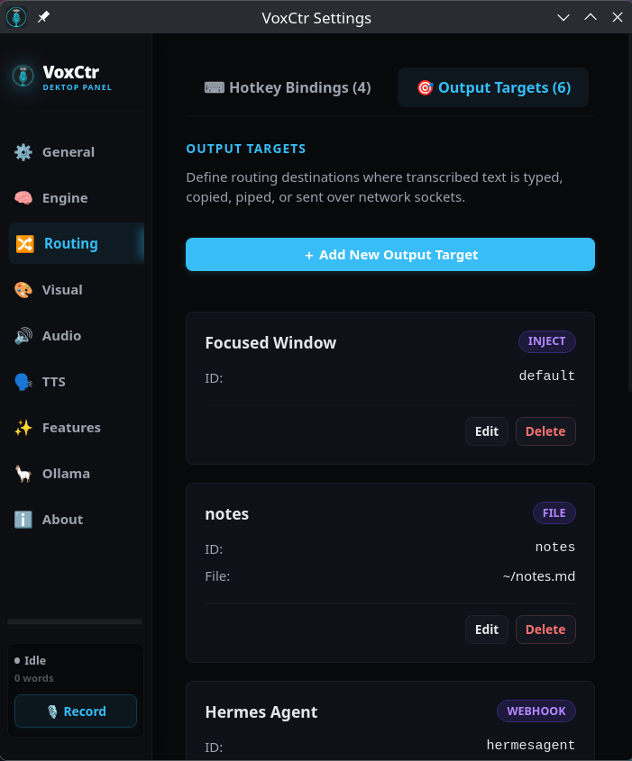

# VoxCtrl


A high-performance, private, on-device voice-to-text dictation application and programmable **voice input broker** built natively in Rust and Tauri with a Svelte frontend. 

**Zero Telemetry. Zero Cloud. 100% On-Device.**
VoxCtrl acts as an intelligent desktop voice gateway, routing your speech to any destination—whether typing directly into a focused window, invoking terminal agents, appending to journals, triggering shell commands, or feeding local AI assistants.

---

## 🔒 Privacy First & Fully On-Device

In an era of cloud processing, VoxCtrl is built from the ground up to guarantee absolute data sovereignty:
* **VoxCtrl does not read your keyboard**: Global shortcuts are registered with your desktop through the XDG `GlobalShortcuts` portal. Your desktop owns the key grab and tells VoxCtrl exactly one thing — that its own shortcut fired. VoxCtrl cannot see what you type in your browser, your terminal, or your password manager, because it is never given the data.
* **No permissions to grant**: No udev rule, no `input` group, no logout, no reboot. There is nothing to undo later, and installing VoxCtrl does not change your machine's security posture. *(Earlier versions installed a udev rule granting read access to every input device. That has been removed — see [why](docs/hotkeys.md#why-this-changed).)*
* **No Cloud API Keys Required**: VoxCtrl relies exclusively on OpenAI's Whisper models (via native CPU/GPU accelerated `whisper-rs`) running directly on your local hardware.
* **No Telemetry**: Your ambient microphone data never leaves your machine. There are no hidden tracking scripts or analytical pings. The one request VoxCtrl makes on its own is the update check — a plain GET to GitHub's public release listing, carrying nothing about you, and off with one tick in Settings → General.
* **Diagnostics only when you send them**: Settings → **Bug Report** gathers a diagnostic bundle and sends it — but only when you press a button, and it shows you the entire report first. Everything you dictated, every API key, every file path, your username and your custom vocabulary are stripped before you ever see it, let alone before it is sent. See [docs/bug_reports.md](docs/bug_reports.md).
* **Air-Gapped Ready**: Once the application and models are downloaded, VoxCtrl requires zero internet access to function.
* **Local Neural Voices**: All text-to-speech feedback is generated offline by a local engine — Breeze-TTS-2, Piper, Pocket-TTS, Inflect-Micro-v2, or eSpeak-NG.

**Full detail, including how to verify each claim yourself: [docs/privacy.md](docs/privacy.md).**

> **The app tells you which of these is true, live.** Settings → Hotkeys shows
> exactly how shortcuts are reaching VoxCtrl and which keys your desktop bound.
> If your desktop provides no shortcuts portal, VoxCtrl says so at launch and
> explains the trade-off — it will not grant itself keyboard access to work
> around it, because that access would apply to every program you run, not just
> this one.
>
> On KDE Plasma specifically, an upstream bug leaves portal shortcuts
> registered but unticked in System Settings until you enable them yourself.
> VoxCtrl detects this and shows a one-click **Open Shortcut Settings** button
> — see [KDE registers shortcuts disabled by default](docs/hotkeys.md#kde-registers-shortcuts-disabled-by-default).

---

## 🌟 Key Features

* **High-Performance Offline Speech Recognition**: Local on-device inference using native `whisper.cpp` (via `whisper-rs`) supporting multi-threaded CPU execution. NVIDIA CUDA GPU acceleration is available as an opt-in compile-time feature (`--features cuda`); Vulkan acceleration (AMD/Intel/NVIDIA) works in the standard build. The Moonshine ONNX backend is compiled in by default, and **runs on the CPU** in every build published today: ONNX Runtime has no Vulkan backend, so the Vulkan build accelerates whisper.cpp only. Moonshine holds its weights in RAM as fp32 (~530 MB for `base`, ~240 MB for `tiny`) where whisper.cpp puts a quantized model in VRAM, which is worth knowing before switching engines on a memory budget. GPU offload for Moonshine is available opt-in at build time with `--features moonshine-cuda` (or `moonshine-coreml` on macOS), both of which need the matching runtime. Settings → Engine reports which of these is true for the build you are running.
* **First-Run Setup Wizard**: A new machine is walked through setup in seven steps — pick a transcription engine and model size (downloaded before you continue), bind a hotkey and register it with your desktop, choose an overlay, dictate a live test, and optionally add a voice — instead of being dropped into a settings window full of defaults nobody chose. Every choice is written to the config as it is made, so quitting halfway keeps what you picked. Reachable again afterwards with `voxctrl --setup`, or Settings → General → "Open setup wizard".
* **Self-Updating**: VoxCtrl checks GitHub for a newer release on launch, shows what changed, and — if you say yes — downloads the build matching your installation (CPU AppImage, Vulkan AppImage or Windows installer), verifies it against the checksum GitHub published, replaces itself and restarts. Nothing is replaced until a complete, verified file is on disk, so a failed update leaves the working version alone. The check is one unauthenticated request carrying no identifier, and Settings → General turns it off.
* **Modern GUI & Tray System**: A sleek Svelte-based user interface with dedicated, swappable, fully animated overlays (Ocean Wave, Voice Card, Waveform, and Pulse Ring), and a native desktop System Tray utility.
* **Low-Latency Audio Loop**: Streamlined recording and VAD (Voice Activity Detection) built using `cpal` to minimize capture latency, with optional RNNoise background-noise suppression on the capture path.
* **Built-in Model Context Protocol (MCP) Server**: Exposes voice dictation and speech synthesis as high-level JSON-RPC tools to AI clients (like Claude Desktop or Cursor) via local secure sockets—keeping integrations fully local.
* **Privacy-Preserving Global Hotkeys**: Shortcuts are registered with your desktop through the XDG `GlobalShortcuts` portal (KDE Plasma, GNOME 48+, Hyprland), so VoxCtrl receives its own shortcuts and never reads a keystroke. Bind hold-to-talk, toggle-to-talk, double-tap, or double-tap & hold gestures. Works identically on Wayland and X11, with no permission setup at all.
* **DBus Dictation Service**: Exposes `ai.voxctrl.Dictation` on the local Linux session bus, letting you script recording states securely without network exposure.
* **Neural Text-to-Speech (TTS)**: Built-in local voice feedback with a choice of engines — **Breeze-TTS-2** (neural, voice design from natural language prompts; gated HF download under non-commercial license, optional CUDA/Metal GPU offload), **Piper** (neural, high quality), **Pocket-TTS** (neural, clones a voice from a reference clip), **Inflect-Micro-v2** (neural, 38 MB ONNX), and **eSpeak-NG** (lightweight, always available) — with automatic local package installation and an in-app model downloader.
* **Intelligent Post-Processing & LLM Rewriting**: Real-time automatic filler-word cleanup (e.g. stripping "um", "uh", "hmm") to sanitize dictation, combined with optional post-processing through any **OpenAI-compatible API server** (a local [Ollama](https://ollama.ai/) or LM Studio instance, or a hosted provider) for real-time grammar correction, tone rewriting, or custom formatting. Point it at any URL and supply an API key when the server requires one.

---

## 🎯 Output Commands — The Deep Targeting System

The core of VoxCtrl is its **Output Command Router**. Rather than simply pasting text where your cursor is, VoxCtrl allows you to declare **named output commands** in `targets.toml` and bind them to different global keyboard gestures. This turns your voice into a programmable router.

**Say a command by name.** Start dictation and say *"VoxCtrl"*, then the command's
name, then what you want to send — *"VoxCtrl notes, remember to call the plumber"*
routes *remember to call the plumber* to the command named **notes**. Everything
after the name is the text, natural phrasing works (*"VoxCtrl, add this to my
notes: …"*), and a dictation with no such phrase in it simply goes wherever your
hotkey already points. See [docs/routing.md](docs/routing.md#command--voice-command-router)
for the full matching rules.

**New in v0.1:** You can now bind **multiple commands** to a single hotkey gesture! When activated, your text is broadcast concurrently to all bound commands. Configurations also **hot-reload instantly** in the background, without requiring an app restart.

Below are the 11 delivery types supported by VoxCtrl and what they are used for:

| Delivery Type | Mechanism | Perfect Use Case |
| :--- | :--- | :--- |
| **`inject`** | Keystroke simulation via native `wtype` (Wayland), `xdotool` (X11), or PowerShell (Windows). | Standard voice dictation directly into any focused editor, web browser, or chat window. |
| **`clipboard`** | Fast clipboard population using the native `arboard` library. | Quiet copying of notes, code snippets, or templates for manual pasting without modifying active focuses. |
| **`exec`** | Spawns a shell command substituting `{TEXT}` cleanly and safely (uses `shell=False` to prevent command injection). | Integrating with CLI tools (e.g., pipe directly into `llm {TEXT}`, open a web search, or post to `git commit -m "{TEXT}"`). |
| **`pipe`** | Writes raw transcription bytes to a local named FIFO pipe. | Interfacing with custom CLI shell scripts, event listeners, or local terminal agents waiting for command buffers. |
| **`socket`** | Streams text directly over a TCP connection or local Unix Domain Socket. | Communicating with long-running daemons, remote servers, or external development container environments. |
| **`file`** | Appends transcriptions to a local file with customizable prefixes and optional UTC timestamps. | Automatic hands-free voice journaling, log keeping, standup note compilation, or task lists. |
| **`dbus`** | Emits a custom DBus signal containing the text on the session bus. | Triggering complex desktop notification actions, scripting custom desktop widget updates, or chaining custom system automation. |
| **`http`** | Sends a fast HTTP POST/GET request containing the transcription formatted inside a JSON template. | Streaming transcriptions directly to webhooks, database ingestion services, or remote HTTP endpoints. |
| **`webhook`** | Sends a signed, secure HTTP POST request with an HMAC-SHA256 signature generated using a shared secret. | Securely connecting dictation triggers to external APIs or home automation platforms (e.g., Home Assistant). |
| **`speak`** | Plays back the transcribed text aloud via the globally configured Text-to-Speech (TTS) engine. | Hearing the transcribed text spoken back to you directly, even without an active MCP server connection. |
| **`chat`** | Holds a running conversation with an OpenAI-compatible `/v1/chat/completions` server, sending prior turns as context and reading the reply back. | Talking to a local LLM — Hermes, Ollama, llama.cpp — hands-free, with the answer spoken aloud, typed at your cursor, or copied to the clipboard. |

> [!TIP]
> `chat` turns VoxCtrl into a voice front end for the same API Open WebUI uses. Enable your
> server's OpenAI-compatible HTTP API, point `chat_url` at it, and speak. See
> [`examples/targets-hermes-chat.toml`](examples/targets-hermes-chat.toml) and the
> [routing reference](docs/routing.md#chat--conversational-llm-openai-compatible).

---

## 🛠️ The Architecture

```
                  ┌──────────────────────────────┐
                  │  Desktop Shortcuts Portal    │
                  │  org.freedesktop.portal.*    │
                  │  GlobalShortcuts             │
                  └──────────────┬───────────────┘
                                 │ "your shortcut fired"
                                 │  (no keystroke data)
                                 ▼
                  ┌──────────────────────────────┐
                  │      Gesture Recognizer      │
                  │  (Hold / Toggle / Double)    │
                  └──────────────┬───────────────┘
                                 │ on_press(target_id)
                                 ▼
                  ┌──────────────────────────────┐
                  │  Recording Module (cpal)     │
                  └──────────────┬───────────────┘
                                 │ float32 raw audio chunks
                                 ▼
                  ┌──────────────────────────────┐
                  │   Whisper Inference Engine   │
                  │  (whisper.cpp via CUDA/CPU)  │
                  └──────────────┬───────────────┘
                                 │ (transcription, target_id)
                                 ▼
                  ┌──────────────────────────────┐
                  │     Output Command Router    │
                  │      (targets.toml)          │
                  └───────┬───────┬────────┬─────┘
                          │       │        │
                          ▼       ▼        ▼
                  ┌──────────────────────────────┐
                  │  Optional AI Post-processing │
                  │  (Filler Removal / LLM API)  │
                  └───────┬───────┬────────┬─────┘
                          │       │        │
            ┌─────────────┘       │        └─────────────┐
            ▼                     ▼                      ▼
     [inject / clipboard]    [exec / pipe / file]   [dbus / http / socket]
            │                     │                      │
            ▼                     ▼                      ▼
     Focused Editor          Terminal / Scripting    Integration Services
```

---

## 🖥️ User Interface

VoxCtrl provides a clean, native settings window and overlay environment:



### 📌 Interactive Settings UI
* **General tab**: Configure core system attributes, including the local MCP JSON-RPC server toggles and record timeouts.
* **Visual tab**: A premium Cyber Obsidian interface that groups all aesthetic and presentation settings. It features an interactive **Overlay Style Selector** (supporting Voice Card, Waveform, Pulse Ring, Ocean Wave, Mono Bars, Neon Spectrum, Retro Terminal, Analog VU, or Disabled styles), toggles for displaying heads-up HUD overlays while speaking, **Command Trigger Overlay toggles and duration sliders**, and controls for sending system notifications on transcription. It also lets you configure if the Settings window should open automatically at launch or start minimized in the system tray.

* **Bug Report tab**: Describe a problem, read the complete report VoxCtrl has assembled from it, and send it — filed for you with no GitHub account needed, opened as a prefilled GitHub issue, saved to a file, or emailed. What is collected and what never is are listed side by side above the form, and redaction works from an allowlist so a setting added later cannot leak by being forgotten. See [docs/bug_reports.md](docs/bug_reports.md).

### 🎨 Heads-Up HUD Overlay Styles

VoxCtrl features a dynamic transparent overlay window — always-on-top and fully click-through — that renders floating real-time audio visualization above your desktop during dictation. Every style has its own identity, audio visualizer, active-target indicator, and animated load/unload transitions. The visual presentation is fully hot-swappable in the **Visual Tab** settings (which synchronizes across windows in real-time) and supports five unique visual options:

1. **Ocean Wave (Default) 🌊**
   A glass tide pool at night with a glowing moon, rising bubbles, and three overlapping parallax wave layers (Deep Blue, Aqua Cyan, and Ice Teal).
   * **Voice Reactive Tide:** Both the waterline and the wave amplitude swell dynamically in response to microphone sound levels, receding to a calm low tide when silent.
   * **Floating Buoy Target Tag:** The active routing target label floats on a buoy that bobs on the wave surface.
   * **Fill & Drain Transitions:** The water fills the pool when dictation starts and drains away when it ends.

2. **Voice Card 💳**
   A literal membership card: gold contact chip, embossed VOXCTRL branding, holographic sheen, and a 20×6 VU-meter LED dot matrix (green→amber→red) lit bottom-up.
   * **Real VU Ballistics:** Instant attack and slow decay, with a sensitivity curve tuned so even quiet speech lights the meter.
   * **Card Flip Transitions:** The card deals in with a flip when dictation starts and flips back out when it ends, with an embossed `TARGET` field and a blinking `REC`/`INIT`/`PROC` stamp.

3. **Waveform 📈**
   A green-phosphor oscilloscope ("OSC-01") with a graticule grid and a live scrolling line trace of your microphone signal, rendered with a phosphor glow. Includes a `TGT ▸` target readout chip and switches to a blue sine sweep during AI post-processing. Powers on and off like a CRT, expanding from (and collapsing back into) a single scanline.

4. **Pulse Ring 🟠**
   A sonar/radar dial: a rotating sweep arm with a trailing wedge, expanding pulse rings that brighten with voice intensity, contact blips that flash as the sweep passes, and an audio-reactive core — paired with a pulsing "TARGET LOCK" plate showing the active routing target.

5. **Disabled (None) ❌**
   Turns off the transparent heads-up display entirely, relying purely on tray icon changes or system bus triggers for dictation feedback.

### ⚡ Command Trigger UI Overlay
Whenever a voice command trigger is matched (e.g. *"VoxCtrl notes Help me!"*), VoxCtrl displays a temporary glassmorphism HUD overlay pill (`⚡ NOTES ▸ Help me!`) showing the target name and text payload summary. The display duration (default: 3s) and enable/disable toggles are configurable under **Settings → Visual Tab**.

### ⚙️ Window Management & Focus Raising
* **Foreground Focus Raising**: If the settings page is already open but hidden behind other windows, clicking the **⚙ Settings** button in the native system tray menu or double-clicking the system tray icon will trigger standard `show()` and `set_focus()` commands to immediately bring the settings dashboard to the absolute foreground of the screen.

---

## 🔌 Built-in Model Context Protocol (MCP) Server

VoxCtrl features a native Model Context Protocol (MCP) server listening on a local Unix socket at `/tmp/voxctrl-mcp.sock`. This allows advanced LLM agents (such as **Claude Desktop** or **Cursor**) to interface directly with your voice and speak responses back to you.

### Exposed MCP Tools
1. **`transcribe_voice(timeout_seconds)`**: Prompts the application to open your default recording device, capture speech, transcribe it using the Whisper engine, and return the raw text to the model. The argument is optional — omit it and VoxCtrl listens for the **Record timeout** configured in Settings → General.
2. **`speak_text(text)`**: Queues text to be spoken aloud locally on the user's host machine using the configured neural TTS engine.
3. **`get_status()`**: Returns a JSON object with boolean states indicating whether the microphone is currently recording or the TTS engine is currently speaking.

### 🎯 Generic MCP Routing Target
VoxCtrl supports routing transcribed text directly to any local or networked MCP server via its **Output Command Router** using the `mcp` delivery type in `targets.toml`. 

The client is fully standard-compliant (Option B, performing `initialize` -> `notifications/initialized` -> `tools/call` handshakes on socket connect) to guarantee maximum compatibility with strict third-party MCP servers.

#### Configuration Schema
You can declare generic MCP targets in your `targets.toml` or configure them through the GUI Settings window:

```toml
[[target]]
id = "self_speak"
label = "Synthesize Speech Loopback"
delivery = "mcp"
mcp_path = "/tmp/voxctrl-mcp.sock"   # Optional custom socket or pipe path (defaults to standard socket/pipe)
mcp_tool = "speak_text"            # The name of the MCP tool to call (defaults to 'speak_text')

[target.mcp_args]
text = "{TEXT}"                    # Custom arguments template (substitutes the transcription at {TEXT})
```

### 🗣️ Voice Command Router (`command`)
VoxCtrl includes a **Voice Command Router** target (`delivery = "command"`) that dynamically inspects dictated speech and reroutes text payload based on spoken target names.

- **Trigger Phrase**: Listens for `"VoxCtrl"` (e.g. `"VoxCtrl"`, `"voxctrl"`, `"vox ctrl"`).
- **Conversational Command Support**: Accepts natural lead-in phrases (e.g. *"VoxCtrl send this to my notes. I love you."*, *"VoxCtrl add this to my personal notes, help"*, or *"VoxCtrl put this in Notes: hello"*).
- **Target Resolution**: Matches spoken target names against all configured target IDs and Labels, automatically prioritizing specific multi-word targets (e.g. `"Personal Notes"` is matched before `"Notes"`).
- **Command UI Overlay**: Displays a temporary purple/indigo HUD overlay (`⚡ TARGET ▸ Summary`) showing the executed command target and text summary for a configurable duration (default: 3s).
- **Fallback**: If no `"VoxCtrl"` keyword is spoken, dictation types directly into your active window as normal.

---

## 📦 Portable AppImage & Installation

VoxCtrl runs natively on Linux (optimized for CachyOS/Arch, Ubuntu/Debian, Fedora, and openSUSE). We support seamless standalone execution using a portable **AppImage**, which features a built-in installer to handle system integration.

### 1. Just Run It

```bash
chmod +x VoxCtrl-*-x86_64.AppImage
./VoxCtrl-*-x86_64.AppImage
```

That is the whole installation. Global shortcuts need no permissions, and
VoxCtrl registers its own `.desktop` entry and icon under `~/.local/share/` on
every Linux launch — no privileges, no install step.

Nothing has to be installed first — not even `libfuse2`: the AppImage's runtime
uses your system's FUSE 3, and extracts and runs itself when FUSE is
unavailable. It needs glibc 2.35 or newer (Ubuntu 22.04+, Linux Mint 21+,
Debian 12+, Fedora 36+, Arch); older distributions have to build from source.

The only thing that can need a package manager is the helper that types text
into other windows (`wtype` on Wayland, `xdotool` on X11). If it is missing, the
setup window says so and offers to install it, or shows you the command. You can
also do that step up front with `./VoxCtrl-*-x86_64.AppImage --install`, which
installs those packages and nothing else.

> [!IMPORTANT]
> **The installer does not touch keyboard permissions, and there is no step that does.**
> Global shortcuts go through the XDG desktop portal, so nothing needs granting.
> The administrator prompt is for installing the packages above and nothing else.
>
> Older VoxCtrl versions wrote `/etc/udev/rules.d/99-voxctrl.rules`, which let
> every program running as your user read every keystroke on your system. The
> installer now **removes** that rule if it finds it, and never creates it.
> [Why](docs/hotkeys.md#why-this-changed).

> [!NOTE]
> VoxCtrl keeps watching: if shortcuts cannot reach it, it says so in the tray
> and in a notification rather than silently ignoring your keypress, and it
> starts working the moment the situation changes — without an app restart.

---

### 2. Standalone AppImage Compilation

If you wish to compile the application and bundle a fresh, portable AppImage manually from source, run the dedicated compiler script:

```bash
chmod +x build_appimage.sh
./build_appimage.sh
```

This compilation script:
* Restructures the workspace compiler toolchain, wrapping the local `appimagetool` to execute inside headless and FUSE-less build/sandbox environments using `--appimage-extract-and-run`.
* Runs frontend compilation via Vite/Svelte and compiles the Rust Tauri backend.
* Automatically injects system GPU/CUDA library paths into the compiler environment for hardware-accelerated transcription (if compatible NVIDIA cards are present).
* Moves and exposes the final, standalone, portable AppImage directly to the root of the workspace as `VoxCtrl-x86_64.AppImage`.

---

### 3. Execution Options

Once set up, you can execute the application in three ways:

* **From Desktop Menu**: Launch **VoxCtrl** directly from your desktop launcher or application drawer.
* **Standalone Portable AppImage**: Run the standalone AppImage executable in the root directory:
  ```bash
  ./VoxCtrl-x86_64.AppImage
  ```
* **Helper Script Wrapper**: Run the workspace helper script:
  ```bash
  ./voxctrl.sh
  ```

---

## ⚙️ Configuration File Schema

All configurations are stored locally inside `~/.config/voxctrl/`.

### `targets.toml`
Defines your Output Commands. The file and its `[[target]]` blocks keep their
original names on disk, so an existing config needs no changes:
```toml
format_version = "1.1"

[[target]]
id = "default"
label = "Focused Window"
delivery = "inject"

[[target]]
id = "notes"
label = "Meeting Journal"
delivery = "file"
file_path = "~/Documents/meeting_notes.md"
file_prefix = "- "
file_timestamp = true
file_timestamp_format = "%Y-%m-%dT%H:%M:%SZ"

[[target]]
id = "cmd_router"
label = "Voice Command Router"
delivery = "command"                  # Dynamically routes speech based on "VoxCtrl <target> <text>" keyword
```

### `bindings.toml`
Binds hotkey gestures directly to target IDs (supports single or **multiple sequential targets**):
```toml
format_version = "1.1"

[[binding]]
id = "dictate_hold"
label = "Dictate into Focused Window (Hold)"
keys = ["KEY_LEFTMETA", "KEY_SPACE"]
gesture = "hold"
target_id = "default"

[[binding]]
id = "dictate_and_log"
label = "Type & Save Journal (Hold)"
keys = ["KEY_LEFTCTRL", "KEY_LEFTMETA", "KEY_SPACE"]
gesture = "hold"
target_id = "default"                        # Backward compatibility fallback (first target)
target_ids = ["default", "notes"]            # Sequential delivery to both targets!

[[binding]]
id = "double_tap_dictation"
label = "Double-Tap & Hold to Dictate"
keys = ["KEY_LEFTMETA", "KEY_SPACE"]
gesture = "double_tap_hold"
tap_ms = 300                                 # Gap allowed between the two taps
hold_threshold_ms = 200                      # Hold on the second tap before recording
target_ids = ["default"]
```

Supported gestures are `hold`, `toggle`, `double_tap` and `double_tap_hold`.
See [docs/hotkeys.md](docs/hotkeys.md) for how each behaves and how to tune the
double-tap timings.

### Multi-Command Hotkey Bindings
VoxCtrl supports routing your speech to **multiple Output Commands simultaneously** using a single hotkey gesture! 

When a multi-target binding is activated:
1. Your speech is captured and transcribed **once**.
2. The final text is delivered **sequentially** to each target specified in `target_ids`.
3. The UI automatically ensures you cannot assign the same target more than once to prevent accidental duplicates.

#### Svelte UI Target Setup
Inside the Hotkey Binding Editor modal:
- Dynamic target selector fields let you add additional routing destinations using the `＋ Add Target` button.
- Already selected targets are automatically disabled in other dropdowns so you cannot select duplicates.
- Extra dropdown rows feature a clear `✕` button to remove them if added by accident.

---

## 🧪 Development & Verification

### Running the Frontend
To run the Svelte UI in standard hot-reloading development mode:
```bash
cargo tauri dev
```

### Compiling manually
```bash
npm run build
npx tauri build
```

---

## 📄 License

This project is open-source and licensed under the [MIT License](LICENSE).
