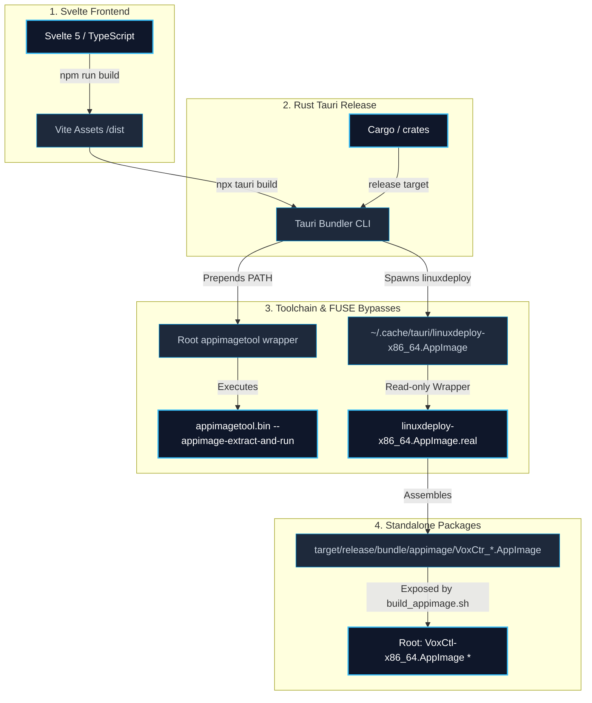

# AppImage Build & Packaging Deployment Guide

This document provides complete instructions and design details for compiling, packaging, and deploying the **VoxCtr** desktop application into a portable, standalone Linux **AppImage**. It serves as an authoritative playbook for developers and automated agents to execute rapid, error-free production releases.

---

## 🏗️ Packaging Architecture & Data Flow

Below is the workflow showing how the frontend, backend compiler, local system wrappers, and write-protected platform tools assemble into a portable AppImage:



---

## 🛠️ Prerequisites & Host Build Environment

Before executing a build, ensure the host machine has the core compilation packages and AppImage extraction tools installed.

### System Package Requirements

| Package | Purpose | Package Name (Arch) | Package Name (Debian/Ubuntu) |
|:---|:---|:---|:---|
| **Squashfs Extraction** | Allows FUSE-less extraction of packaging AppImages. | `squashfs-tools` | `squashfs-tools` |
| **Rust Toolchain** | Rust compiler and Cargo bundle tools. | `rustup` / `rust` | `rustc` / `cargo` |
| **Node.js Environment** | Package manager and Vite bundling. | `nodejs` `npm` | `nodejs` `npm` |
| **System Webview** | Tauri interface runtime dependency. | `webkit2gtk-4.1` | `libwebkit2gtk-4.1-dev` |
| **Audio Library** | Low-latency audio capture via CPAL/ALSA. | `alsa-lib` | `libasound2-dev` |
| **Desktop Integrations**| System tray application icons support. | `libayatana-appindicator` | `libayatana-appindicator3-dev` |

### Rapid Prerequisites Install
* **Arch Linux / CachyOS**:
  ```bash
  sudo pacman -S --needed base-devel rustup nodejs npm webkit2gtk-4.1 alsa-lib libayatana-appindicator squashfs-tools
  ```
* **Ubuntu / Debian**:
  ```bash
  sudo apt-get update
  sudo apt-get install -y build-essential curl nodejs npm pkg-config libwebkit2gtk-4.1-dev libssl-dev libayatana-appindicator3-dev libasound2-dev squashfs-tools
  ```

---

## 🚀 Quick-Start Build Instructions

To build a fresh deployment AppImage, run the automated compile script from the **project root**:

```bash
chmod +x build_appimage.sh
./build_appimage.sh
```

### What `build_appimage.sh` does automatically:
1. **Toolchain Check**: Validates that `unsquashfs` is present to support FUSE-less unpacking.
2. **Frontend Compiles**: Compiles all visual assets and generates the optimized production build (`/dist`).
3. **Environment Setup**: Prepends the workspace root to the shell `$PATH` and exports `APPIMAGE_EXTRACT_AND_RUN=1` and `QT_QPA_PLATFORM=offscreen` to allow FUSE-less head-free compilation.
4. **Tauri Releases**: Runs `npx tauri build` to compile the optimized release binary and bundles it using the FUSE-bypass tools.
5. **Relocation**: Copies the completed executable as `VoxCtl-x86_64.AppImage` directly in the project root. Note: the output filename uses `VoxCtl` (with a lowercase `l`) — this is the legacy artifact name produced by `build_appimage.sh` and has not yet been renamed to match the current `VoxCtr` branding.

---

## 🔒 Crucial Troubleshooting: Bypassing the Platform Shebang Bug

If the bundling process fails at the AppImage packaging stage with a generic system error:
```
failed to bundle project `No such file or directory (os error 2)`
```

### 1. The Root Cause (The Platform Shebang Bug)
The IDE/container sandbox environment features an automated background file-watching daemon that intercepts files inside `~/.cache/tauri/` to sanitize environment paths.
However, due to a byte-truncation bug in the platform's wrapper generator, the daemon automatically rewrites `~/.cache/tauri/linuxdeploy-x86_64.AppImage` to utilize a **corrupted interpreter shebang**:
```bash
#!/bin/b   
```
Because the Linux kernel cannot find `/bin/b` to execute the wrapper, it fails with a low-level `ENOENT` (os error 2) instantly.

### 2. The Solution (Immutable Lockdown)
To resolve this, we bypass the platform's editor hooks by writing the correct bash script directly via shell redirection and **revoking write permissions** to make it read-only. Run these commands:

```bash
# 1. Re-write the correct wrapper script directly via the shell
# NOTE: If your IDE/container injects a custom PATH entry that is being
#       written into the shebang, adjust the sed pattern below to match
#       your environment's injected bin path.
cat << 'EOF' > ~/.cache/tauri/linuxdeploy-x86_64.AppImage
#!/bin/bash
export APPIMAGE_EXTRACT_AND_RUN=1
export NO_STRIP=1
export QT_QPA_PLATFORM=offscreen
# Remove any IDE-injected PATH entries that corrupt the linuxdeploy wrapper.
# Adjust the pattern below to match your environment if needed.
export PATH=$(echo $PATH | sed 's|<YOUR_IDE_BIN_PATH>:||g')
exec "$HOME/.cache/tauri/linuxdeploy-x86_64.AppImage.real" "$@" --exclude-library=libselinux* --exclude-library=libgio* --exclude-library=*gdk_pixbuf*
EOF

# 2. REVOKE write permissions to make the file immutable to the broken platform hook
chmod 555 ~/.cache/tauri/linuxdeploy-x86_64.AppImage

# 3. Make sure the helper plugin is also protected
chmod 555 ~/.cache/tauri/linuxdeploy-plugin-appimage.AppImage
```

Once locked, the platform is physically blocked from corrupting the shebang, and `./build_appimage.sh` will bundle successfully.

---

## 📦 Deploying onto a New Machine

To run the completed portable application on a fresh host system, follow these deployment steps:

### 1. Copy the Essential Files
You only need to transfer **two files** to the new machine:
* `VoxCtl-x86_64.AppImage` (the executable)
* `install.sh` (the host setup script)

### 2. Run the Unified Setup
Run the setup script on the new machine once to pull in runtime dependencies, register global hotkey udev rules, and register a desktop launcher menu item:

```bash
chmod +x install.sh
./install.sh
```

### 3. Apply Group Privileges
Because `install.sh` adds your account to the low-level `input` group for global hardware hotkeys, **you must log out and log back in** (or reboot) before launching the application.

---

## 📋 Build Flags & Config Reference

* **Tauri Config (`src-tauri/tauri.conf.json`)**:
  * `"targets": ["appimage"]`: Isolated to bundle exclusively the AppImage target. Can be set back to `"all"` to compile `.deb` and `.rpm` files if production repositories require standard package formats.
* **Environment Variables**:
  * `APPIMAGE_EXTRACT_AND_RUN=1`: Directs packaging and runtime binaries to extract themselves into `/tmp` rather than attempting FUSE mounts.
  * `QT_QPA_PLATFORM=offscreen`: Prevents Qt platform errors inside display-less or restricted terminal workspaces.
